# 🌹 Projet Saint Valentin 2026 - Lycée Jules Fil

> Une initiative numérique au service du Lycée Jules Fil, alliant passion technique et événementiel scolaire.

---

## 📖 À propos

Ce projet est une application web complète conçue pour gérer l'événement de la **Saint Valentin** organisé par le CVL (Conseil de la Vie Lycéenne). Il permet la prise de commande de roses, la gestion des paiements, l'organisation de la distribution et l'administration des comptes élèves.

Il a été réalisé entièrement sur le **temps personnel** du développeur (environ **70 heures** de conception) en parallèle d'une alternance.

### 👤 L'Auteur
**Théo Marescal**
* 🎓 Administrateur d'Infrastructures Sécurisées (AIS) / BTS CIEL.
* 💼 Alternant & Étudiant passionné.
* 🌐 Portfolio : [projets.marescal.fr](https://projets.marescal.fr)

### 🤖 Développement Assisté par IA
Ce projet est le fruit d'une collaboration "Pair Programming" avec **Gemini AI**.
* **Théo** : Architecture, logique métier, sécurité et pilotage.
* **IA** : Co-pilote technique, optimisation SQL, accélération de l'écriture.

---

## 🛠️ Stack Technique

Ce projet repose sur une architecture robuste et sécurisée :

| Domaine | Technologies |
| :--- | :--- |
| **Backend** |  |
| **Base de données** |  |
| **Frontend** |    |
| **Scripting** |  |
| **Focus** | 🛡️ **Cybersécurité** & Expérience Utilisateur (UX) |

---

## 🚀 Fonctionnalités Principales

* **Gestion des Utilisateurs** : Inscription, connexion, rôles (Admin, CVL, Élève).
* **Commandes** : Achat de roses, choix des destinataires, messages personnalisés (anonymes ou non).
* **Administration** : Dashboard complet pour suivre les ventes, gérer les stocks et valider les paiements.
* **Distribution** : Outils pour faciliter la logistique le jour J (tri par classe, listes de distribution).

---

## 🤝 Équipe Organisatrice

Un grand merci aux membres du **CVL (Conseil de la Vie Lycéenne)** pour l'organisation logistique et l'animation de l'événement au sein du lycée. Sans leur énergie, cet outil technique n'aurait pas d'utilité.

---

## 🔮 Avenir du Projet & Maintenance

> **Note importante pour les futurs développeurs du CVL :**

Ce projet a été conçu pour être **pérenne et réutilisable** pour les futures éditions de la Saint Valentin au lycée Jules Fil.

Cependant, comme tout projet développé sur un temps limité, il contient une certaine **dette technique**.
* 🐛 **Bugs mineurs** : Il peut rester des imperfections d'affichage ou des cas limites non gérés.
* ♻️ **Évolutions** : Le code est voué à évoluer. Il est fortement encouragé de le refactoriser, de le sécuriser davantage et de l'adapter aux nouveaux besoins du lycée dans les années à venir.

Considérez cette version comme une **base solide (V1)** qui ne demande qu'à être améliorée par les prochaines promotions d'élèves passionnés d'informatique !

---

## 📸 Aperçus de l'Interface

Voici quelques captures d'écran illustrant les différentes facettes de l'application.

### 🏠 Espace Élève & Inscription
| Page de Bienvenue | Création de Compte | À propos |
| :---: | :---: | :---: |
| 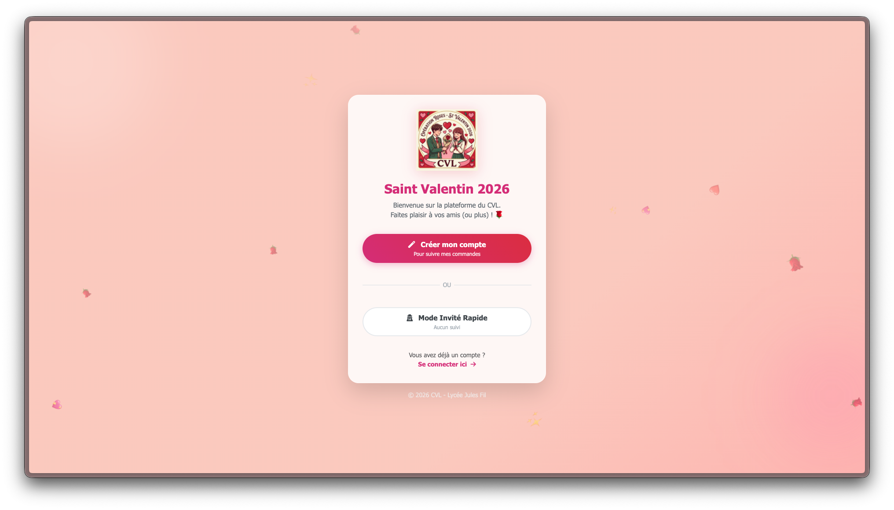 | 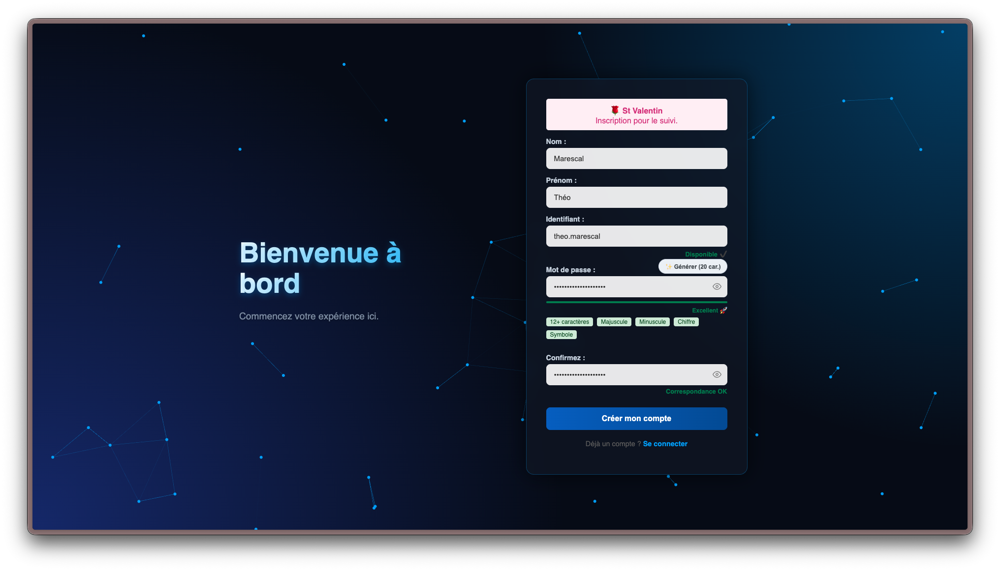 | 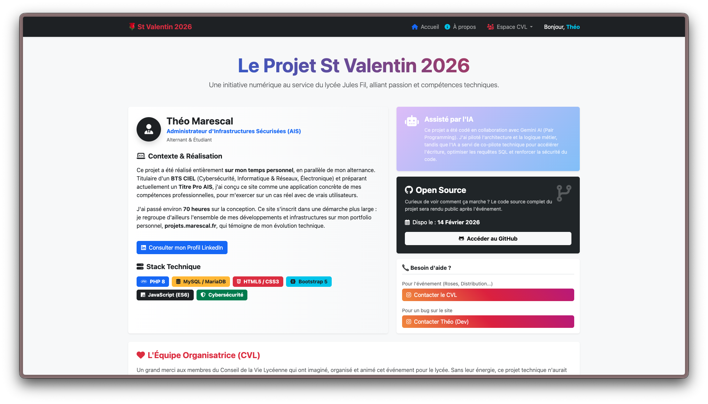 |

### 📊 Dashboards & Statistiques (Vue CVL)
| Vue d'ensemble des commandes | Modifications des commandes | Statistiques de Vente |
| :---: | :---: | :---: |
| 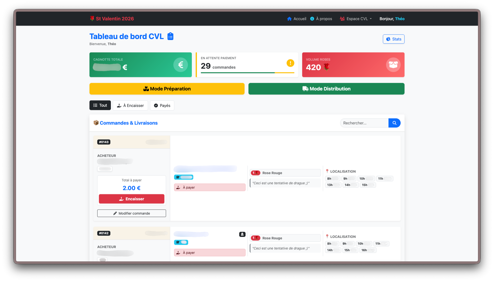 | 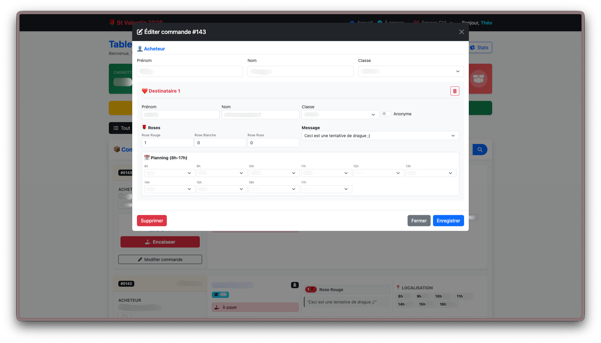 | 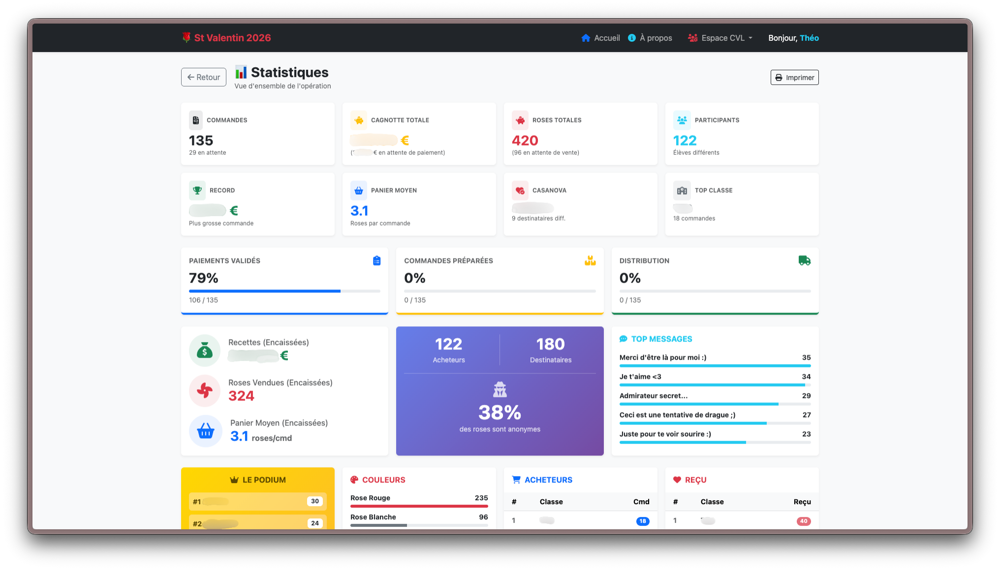 |

### ⚙️ Logistique
| Mode Préparation | Mode Distribution | Impression Étiquettes |
| :---: | :---: | :---: |
| 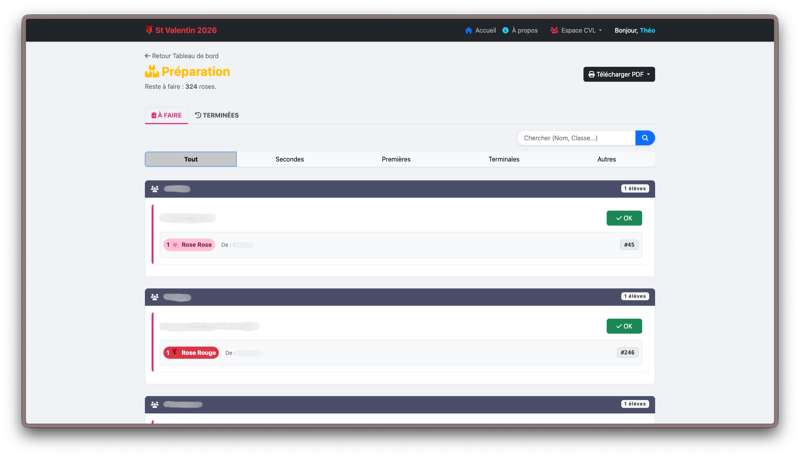 | 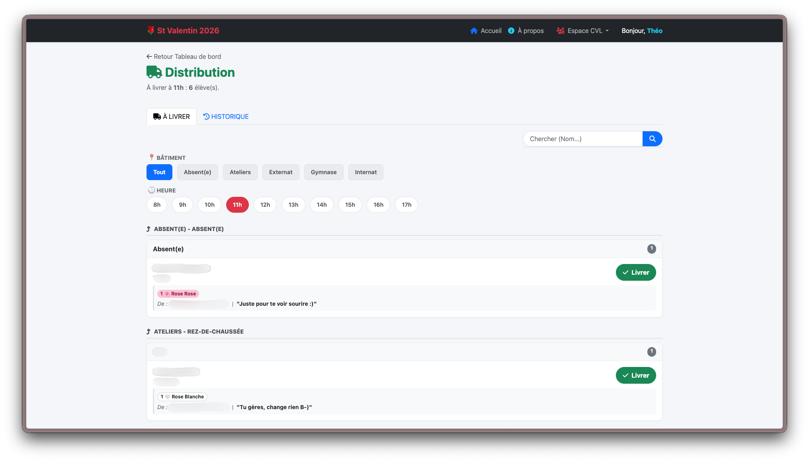 | 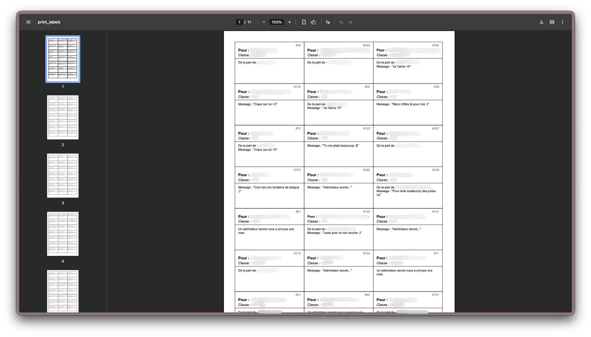 |

### 🛠️ Administration & Sécurité
| Zone d'Administration | Logs Système | Annuaire |
| :---: | :---: | :---: |
| 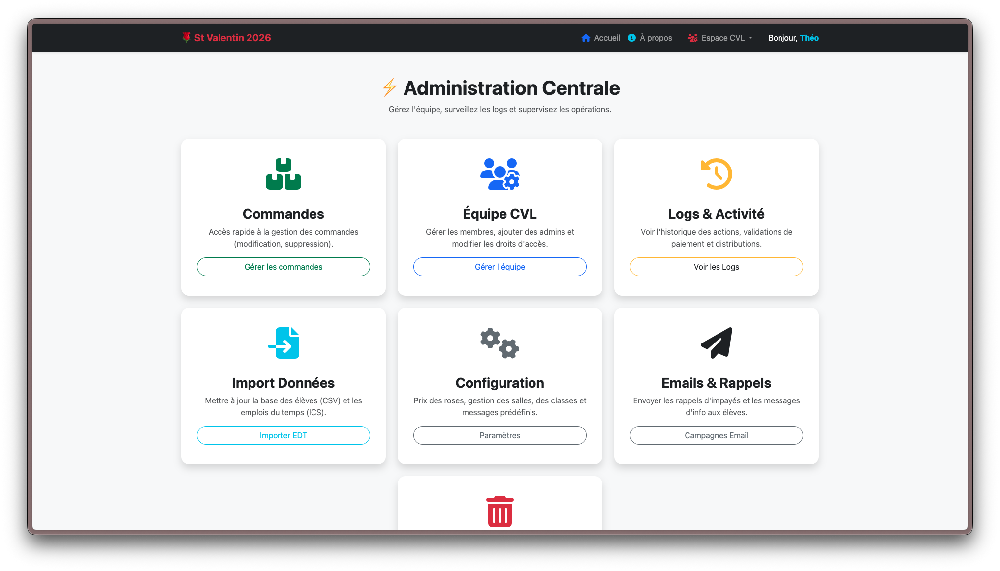 | 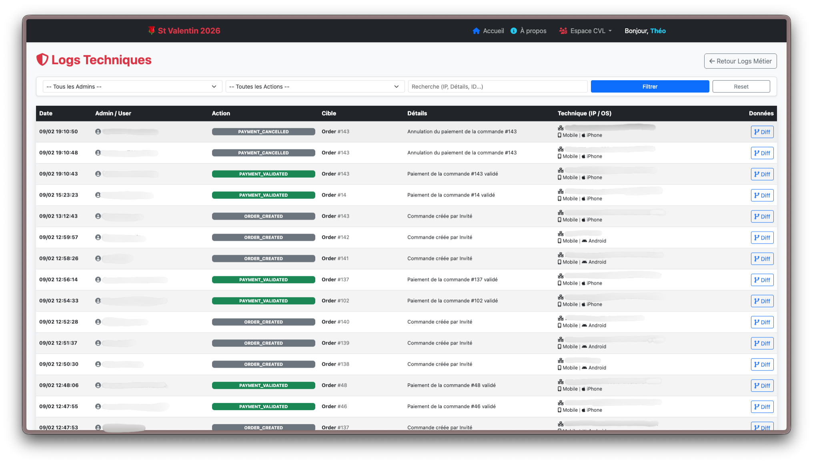 | 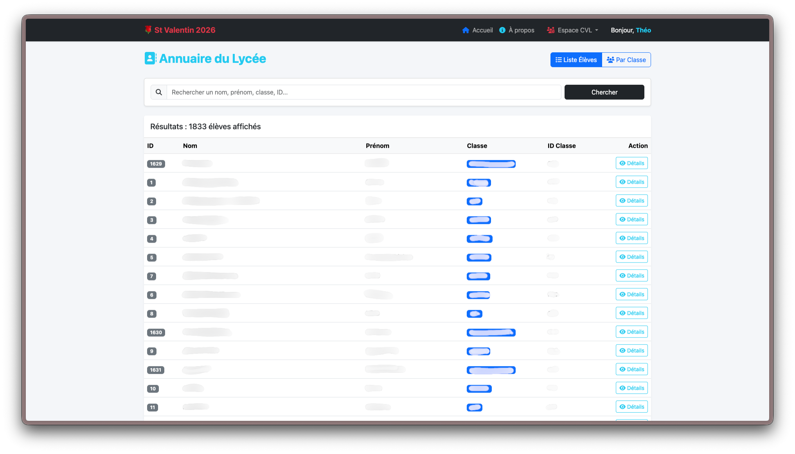 |

---

    
© 2026 Théo Marescal • Tous droits réservés.

    
<i>Développé avec passion et rigueur.</i>

